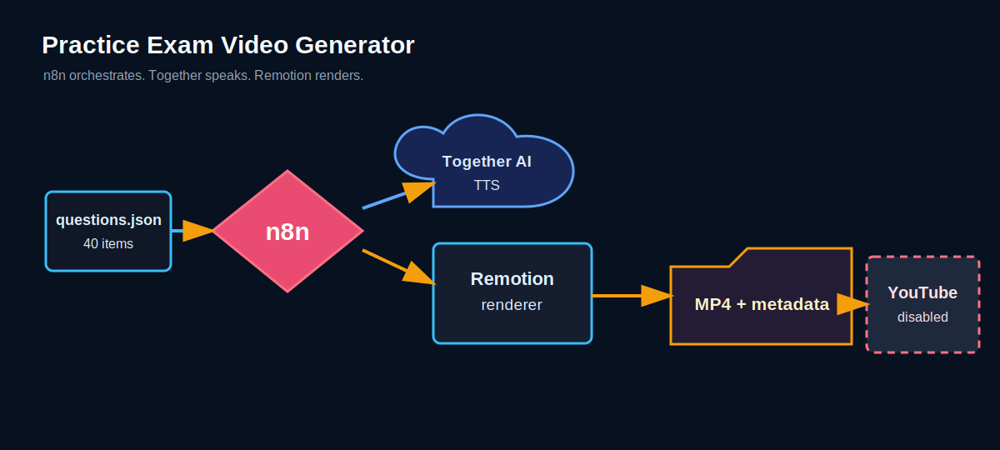
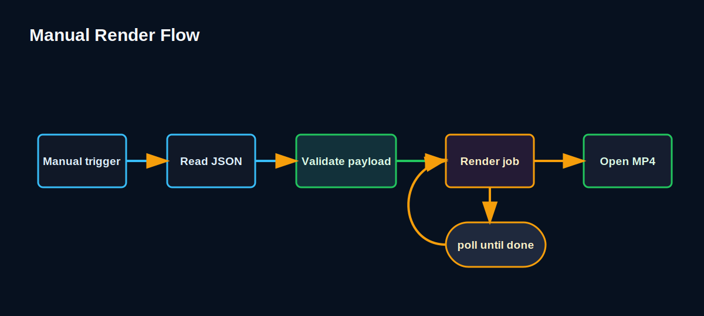
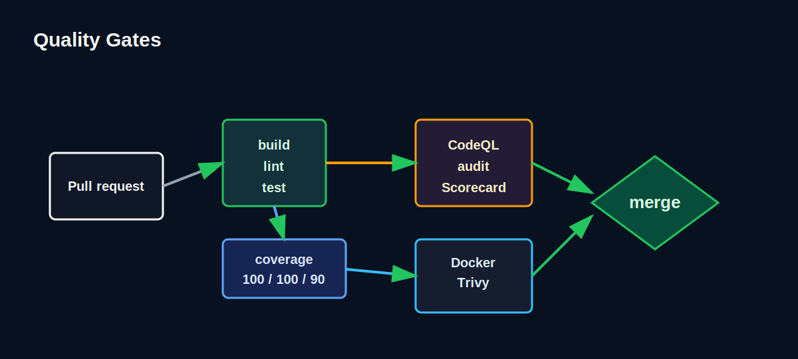

# n8n Practice Exam Generator

Generate a polished practice-exam walkthrough video from `questions.json` with n8n orchestration and a typed Remotion renderer.

## Run This POC

These steps are the expected happy path from a fresh checkout to a playable MP4.

```bash
cd /Volumes/WorkSSD/repositories/StudyBuddies/n8n_practice_exam_generator
npm install
cp .env.example .env
npm run check
npm start
```

Then:

1. Open <http://localhost:5678>.
2. Create the local n8n owner account when prompted.
3. Import [n8n/workflows/01_generate_practice_exam_walkthrough.json](/Volumes/WorkSSD/repositories/StudyBuddies/n8n_practice_exam_generator/n8n/workflows/01_generate_practice_exam_walkthrough.json).
4. Open the imported workflow and click **Execute workflow**.
5. Wait for the renderer status to become `done`.
6. Open the MP4 from `data/artifacts/<job-id>/practice-exam-walkthrough.mp4`.
7. Stop the stack with `Ctrl+C`, or from another terminal:

```bash
npm run stop
```

The checked-in [questions.json](/Volumes/WorkSSD/repositories/StudyBuddies/n8n_practice_exam_generator/questions.json) already contains the 40-question n8n practice exam. Replace that file later if you want a different exam.

## Expected Output

The generated video is a long-form 16:9 walkthrough:

- intro slide with exam title and question count
- 40 question slides with options, progress, think timer, answer reveal, and explanation
- midpoint checkpoint after question 20
- outro slide with review prompt

YouTube upload is intentionally disabled. The renderer writes `youtube-metadata.json` next to the MP4, and the YouTube workflow is a guarded placeholder.

## Architecture

This project is split the way a production n8n project should be split:

- **n8n** orchestrates the workflow, retries, status polling, external APIs, notifications, and publishing.
- **Postgres** stores question state and render/publish history for the production path.
- **Together AI** generates the question narration audio for full renders.
- **Remotion renderer service** owns typed media rendering, artifacts, metadata, and render safety checks.

The first golden path renders one long-form walkthrough video, not 40 Shorts.

### Diagrams







## Fast Renderer Smoke Test

Use this when you only want to test the renderer without opening n8n.

```bash
npm run build
npm run dev:renderer
```

In a second terminal:

```bash
npm run smoke
```

The smoke test renders a short dry-run video and prints the artifact URL. Full workflow renders are written under `data/artifacts/`.

The renderer health endpoint is:

```bash
curl http://localhost:3030/healthz
```

## File-Based Render API

```bash
node scripts/build-render-payload.mjs questions.json > /tmp/render-payload.json
curl -X POST http://localhost:3030/render \
  -H 'content-type: application/json' \
  --data-binary @/tmp/render-payload.json
```

Postgres question state is already scaffolded, but the first demo path stays file-based so the POC is easy to run and review.

## Local Development

```bash
npm run build
npm run lint
npm test
npm run coverage
npm run security
npm run smoke
```

`npm run smoke` renders a short dry-run video without Together AI or YouTube credentials. The main n8n workflow renders with Together AI narration and requires `TOGETHER_API_KEY`.

Install the repo-local pre-commit hook with:

```bash
npm run hooks:install
```

## Workflow Shape

1. Read `questions.json`.
2. Take the first 40 questions.
3. Build a validated Remotion render payload.
4. Generate narration with Together AI.
5. Submit a render job to the Remotion renderer.
6. Poll render status until complete.
7. Build deterministic YouTube metadata.
8. Stop there for now. YouTube upload is a manual-only placeholder.

The Postgres schema and reservation queries are included for the production version, where repeated uploads must track used, failed, and published questions.

## YouTube Placeholder

The renderer writes a `youtube-metadata.json` next to the MP4. The workflow [03_upload_to_youtube_placeholder.json](/Volumes/WorkSSD/repositories/StudyBuddies/n8n_practice_exam_generator/n8n/workflows/03_upload_to_youtube_placeholder.json) is manual-only and guarded by:

```text
YOUTUBE_UPLOAD_ENABLED=true
```

Until that is set, it only reports that upload is skipped.

## Safety Patterns

- `questions.json` is validated for exactly 40 well-formed questions.
- Questions are deduplicated by content hash.
- Runs are idempotent through `video_runs`.
- Renderer jobs are asynchronous and pollable.
- Render inputs are schema-validated before work starts.
- Renderer requests have a body-size limit and optional bearer-token auth.
- n8n file access is restricted in Compose.
- `.env` is ignored; use `.env.example` as the template.
- Pre-commit runs build, lint, tests, and static security checks.
- Coverage is enforced at 100% lines, 100% functions, and 90% branches for the renderer contract modules.
